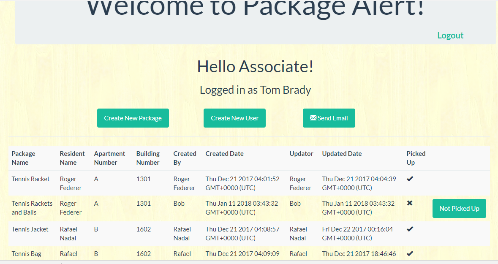
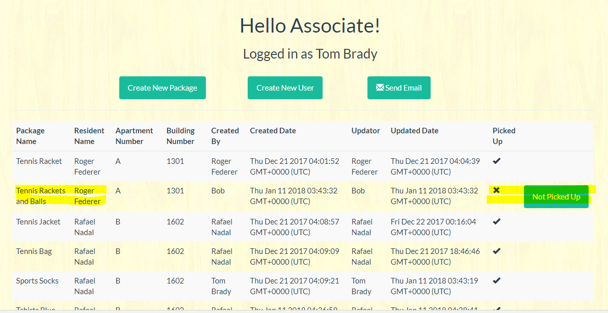

# Package Alert Application 

This is a full stack application which notifies users via email , if they have a package to be picked up.
This application is built to be used residential community associates. Residents can also have limited access to this application.

We have created two main user roles for this application.

* Associate User Role
	* Can login to the application
	* Can view all the packages for all the users
	* Can create new users in the system
	* Can create new packages for the existing as well as new users
	* Can update the package status when picked up by the residential
	* Can trigger a notification email to residents for the packages not picked up

Below are step by step snapshots of associate functionality
To use the application as an Associate user 
 * login as user/password: tb1/ttbb1

## Associate Login

## Associate Logged In

## Associate's Page all Packages

## Associate's page after Package Status Update for a resident

* Residents User Role
	* Can login to the application
	* Can view their packages once logged in
	* Can update the package status once picked up

Below are step by step snapshots of associate functionality
To use the application as a Resident user
 * login as user/password: rn1/rrnn1

## Resident Login

## Resident Logged In

## Resident Packages

## Resident's page after Package Status Update

You can view the live application deployed on heroku here https://whispering-bastion-28782.herokuapp.com/

## Technology Stack
* Front End: html, css, handlebars
* Back End: Express routes, mySQL DB, Javascript, node.js

